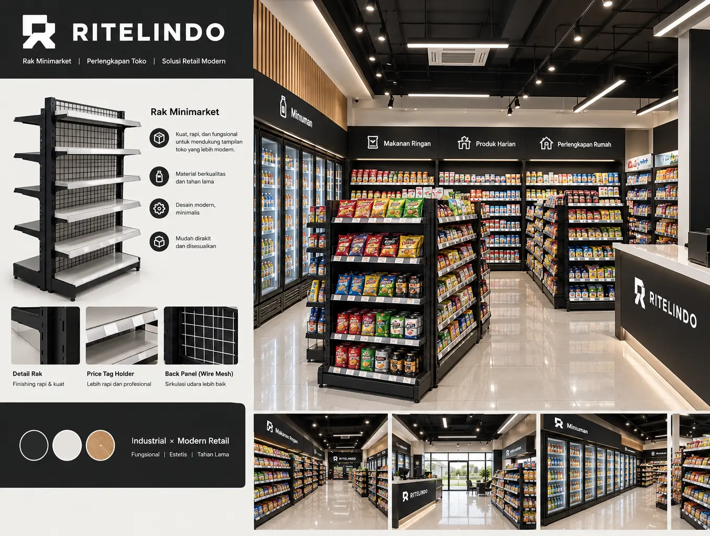

# Ritelindo — Retail Solution Landing Page

Landing page untuk **Ritelindo Group** yang dibuat sebagai bagian dari mini test Web Developer.

Website ini dirancang sebagai landing page campaign untuk kebutuhan **Paket Rak Minimarket / Rak Toko B2B**, dengan fokus utama pada konsultasi melalui WhatsApp.

## ✨ Overview

Ritelindo menyediakan solusi kebutuhan retail mulai dari rak toko, setup toko, custom rak, hingga interior toko.

Landing page ini menampilkan:

* Paket Rak Minimarket
* Rak Gondola
* Rak Dinding
* Konsultasi & Layout 3D Gratis
* Free Ongkir Jawa-Bali
* Free Perakitan Jatim, Jateng & DIY
* Custom ukuran dan konfigurasi rak
* Produk langsung dari pabrik
* Layanan pembelian satuan hingga proyek retail
* Jasa interior toko
* CTA WhatsApp di beberapa bagian halaman

Tujuan utama website adalah memberikan pengalaman yang sederhana, informatif, dan mendorong calon pelanggan untuk melakukan konsultasi.

---

## 🛠️ Tech Stack

Project ini dibuat menggunakan:

* **React**
* **TypeScript**
* **Vite**
* **Tailwind CSS**
* **Framer Motion**
* **Lucide React**
* **React Icons**

### Tools

* Visual Studio Code
* Git & GitHub
* Vercel

---

## 🎨 Design Direction

Konsep visual menggunakan pendekatan:

**Industrial × Modern Retail**

Dengan karakter:

* Clean
* Modern
* Minimal
* Strong typography
* Dominasi warna charcoal / black dan off-white
* Foto produk sebagai visual utama
* Rounded corner secukupnya
* Whitespace yang cukup
* Subtle animation
* Responsive mobile-first

Desain dibuat agar tidak terasa seperti template SaaS yang terlalu repetitif, tetapi lebih menyerupai website brand retail profesional.

---

## 📁 Project Structure

```text
ritelindo-landing/
│
├── public/
│   ├── images/
│   │   ├── hero/
│   │   ├── products/
│   │   └── projects/
│   │
│   └── logo.webp
│
├── src/
│   ├── components/
│   │   ├── Navbar.tsx
│   │   ├── Button.tsx
│   │   ├── SectionHeading.tsx
│   │   ├── Reveal.tsx
│   │   ├── RevealGroup.tsx
│   │   ├── Footer.tsx
│   │   └── FloatingWhatsApp.tsx
│   │
│   ├── sections/
│   │   ├── Hero.tsx
│   │   ├── Benefits.tsx
│   │   ├── Products.tsx
│   │   ├── Process.tsx
│   │   ├── CustomStore.tsx
│   │   ├── Interior.tsx
│   │   ├── Trust.tsx
│   │   └── FinalCTA.tsx
│   │
│   ├── data/
│   │   └── products.ts
│   │
│   ├── assets/
│   │
│   ├── App.tsx
│   ├── main.tsx
│   └── index.css
│
├── index.html
├── vite.config.ts
├── package.json
├── tsconfig.json
└── README.md
```

---

## 🚀 Getting Started

### 1. Clone repository

```bash
git clone <repository-url>
```

Masuk ke folder project:

```bash
cd ritelindo-landing
```

### 2. Install dependencies

```bash
npm install
```

### 3. Jalankan development server

```bash
npm run dev
```

Website dapat diakses melalui URL yang diberikan oleh Vite, biasanya:

```text
http://localhost:5173
```

---

## 📦 Available Scripts

### Development

```bash
npm run dev
```

Menjalankan development server.

### Production Build

```bash
npm run build
```

Membuat production build.

### Preview Production

```bash
npm run preview
```

Menjalankan hasil production build secara lokal.

---

## 📱 Responsive Design

Website dibuat dengan pendekatan **mobile-first** dan disesuaikan untuk beberapa ukuran layar:

* Mobile
* Tablet
* Laptop
* Desktop

Beberapa elemen yang memiliki behavior responsive:

* Navbar dan mobile menu
* Hero layout
* Product cards
* Benefit cards
* Process steps
* Custom & Interior section
* Footer
* Floating WhatsApp button

---

## 🎞️ Animation

Animasi menggunakan **Framer Motion**.

Beberapa jenis animasi yang digunakan:

### Scroll Reveal

Section akan muncul ketika masuk viewport.

```tsx
<Reveal>
  ...
</Reveal>
```

### Stagger Animation

Beberapa item muncul secara berurutan.

```tsx
<RevealGroup stagger={0.12}>
  ...
</RevealGroup>
```

### Hover Interaction

Digunakan secara subtle pada:

* Button
* Product card
* Navigation
* Icon
* Image
* WhatsApp CTA

Animasi dibuat untuk meningkatkan pengalaman pengguna tanpa mengganggu proses browsing.

---

## 💬 WhatsApp CTA

WhatsApp digunakan sebagai primary conversion channel.

Nomor WhatsApp saat ini menggunakan placeholder:

```text
6280000000000
```

Sebelum production, ganti dengan nomor WhatsApp Ritelindo yang sebenarnya.

Format:

```text
628xxxxxxxxxx
```

tanpa tanda `+`, spasi, atau tanda `-`.

Contoh:

```tsx
const whatsappNumber = "6281234567890";
```

Beberapa section menggunakan WhatsApp CTA:

* Navbar
* Hero
* Process
* Custom Store
* Final CTA
* Footer
* Floating WhatsApp

---

## 🖼️ Image Assets

Image digunakan dari folder:

```text
public/images/
```

Struktur:

```text
public/images/
├── hero/
│   └── hero-rak.webp
│
├── products/
│   ├── rak-gondola.webp
│   ├── rak-dinding.webp
│   └── paket-minimarket.webp
│
└── projects/
    └── interior-toko.webp
```

Karena file berada di dalam `public`, image dipanggil menggunakan path dari root.

Contoh:

```tsx

```

Bukan:

```tsx

```

---

## 🔍 SEO

Landing page menggunakan struktur heading yang terorganisir untuk mendukung SEO.

Struktur utama:

```text
H1
└── H2
    └── H3
```

Keyword yang ditargetkan antara lain:

* Pabrik Rak Minimarket
* Rak Minimarket
* Rak Toko
* Paket Setup Toko
* Paket Rak Minimarket
* Rak Gondola
* Rak Dinding
* Interior Toko
* Custom Rak Toko
* Supplier Rak Minimarket

Meta title dan description dapat disesuaikan di:

```text
index.html
```

---

## 📈 Conversion Strategy

Landing page menggunakan pendekatan conversion-focused.

Alur utama pengguna:

```text
Landing Page
      ↓
Value Proposition
      ↓
Produk & Layanan
      ↓
Cara Kerja
      ↓
Custom & Interior
      ↓
Trust / Service Area
      ↓
Konsultasi Gratis
      ↓
WhatsApp
```

Primary CTA:

> Konsultasi WA Gratis

Secondary CTA:

> Lihat Paket Rak

---

## 🔗 Navigation

Navbar menggunakan anchor navigation:

```text
Home
Layanan
Produk
Cara Kerja
Konsultasi
```

Section ID yang digunakan:

```html
#home
#layanan
#produk
#cara-kerja
#konsultasi
```

---

## 🌐 Deployment

Project dapat di-deploy menggunakan **Vercel**.

### Build

Pastikan project dapat di-build:

```bash
npm run build
```

Jika berhasil, project siap untuk deployment.

### Vercel

Import repository GitHub ke Vercel kemudian gunakan konfigurasi default Vite.

Build command:

```text
npm run build
```

Output directory:

```text
dist
```

Tidak membutuhkan backend atau database karena website bersifat **static landing page**.

---

## 📋 Main Sections

### 1. Hero

Memperkenalkan Ritelindo dan value proposition utama.

### 2. Benefits

Menjelaskan alasan memilih Ritelindo, termasuk konsultasi 3D, custom, pabrik, ongkir, perakitan, dan layanan retail.

### 3. Products

Menampilkan produk utama:

* Rak Gondola
* Rak Dinding
* Paket Minimarket

### 4. Process

Menjelaskan proses:

```text
Konsultasi
→
Layout
→
Pilih Paket
→
Produksi & Pengiriman
```

### 5. Custom & Interior

Menjelaskan kemampuan custom rak dan layanan interior toko.

### 6. Trust

Menampilkan target customer dan kemampuan Ritelindo dalam menangani kebutuhan retail.

### 7. Final CTA

Mengarahkan pengguna untuk melakukan konsultasi melalui WhatsApp.

### 8. Footer

Berisi:

* Brand information
* Navigation
* WhatsApp
* Instagram
* LinkedIn
* Copyright

---

## 👨‍💻 Developer

Developed as a Web Developer Mini Test project for:

**Ritelindo Akselera Kolaborasi**

> Retail Solution — Rak · Setup Toko · Interior

---

## 📄 License

This project is created for evaluation / recruitment purposes.

All Ritelindo branding, logo, images, and company-related content belong to their respective owners.
